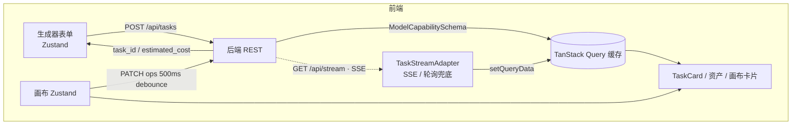

# AIGC Pool 前端设计

> 对应 issue DEM-61，上游 PRD 见 DEM-60 评论 `a05dde80`。
> 本文档只做设计，不含业务代码；脚手架初始化留给实现阶段。
>
> **已定前提（不推翻）**：模型 Key 由平台统一持有 + 积分记账（不接支付）；多用户但只做最简登录（账号密码）；React + TypeScript，前后端分离，先本地跑不部署。

配套契约文件（本文档的规范性附件）：

| 文件 | 作用 |
|---|---|
| [`contracts/capability-schema.ts`](./contracts/capability-schema.ts) | **权威定义**。模型能力声明的全部 TS 类型，后端 L1 层直接照此产出 |
| [`contracts/model-schema.examples.json`](./contracts/model-schema.examples.json) | 两个可运行的示例（图片模型 / 视频模型），覆盖全部 8 种控件 |

正文中的类型片段是节选，**以 `.ts` 文件为准**。

---

## 0. 技术选型（先把地基说死）

| 维度 | 选择 | 理由 / 被否掉的 |
|---|---|---|
| 构建 | **Vite + React 18 + TypeScript（strict）** | — |
| 是否用 Next.js | **不用，纯 SPA** | 前后端分离已定，后端出 JSON、前端出静态资源。工作台全部是登录态动态内容，SSR 只对未登录营销页有价值，而营销页 MVP 不做。引入 Next 等于同时维护一个 Node 服务，和"前后端分离 + 本地跑"的目标相反 |
| 路由 | **react-router-dom v6（data router）** | 需要 loader / 嵌套布局 / 路由级代码分割 |
| 服务端状态 | **TanStack Query** | 模型 schema、资产、任务、项目列表的缓存 / 失效 / 重试 / 游标分页都是现成的 |
| 客户端状态 | **Zustand** | 画布需要细粒度 selector 订阅（一张卡片只订阅自己）。Context+useReducer 做不到（Context 变更全树重渲）；Redux Toolkit 对这个体量偏重 |
| 表单 | **自研 `useDynamicForm(schema)`（~120 行）** | 字段完全由 schema 动态决定，适配 react-hook-form 的动态字段反而更绕。且 CLAUDE.md 明确禁止无谓引入 formik / RHF 这类重依赖 |
| 样式 | **Tailwind CSS + CSS 变量做主题** | 界面是芯片密集型，utility class 迭代快；画布的 transform 走内联 style。若团队不接受 utility class，退路是 CSS Modules，不影响其他设计 |
| 实时通道 | **SSE（自研 fetch 解析器），轮询兜底** | 见 §4.3 |
| 画布渲染 | **DOM + CSS transform** | 见 §5.1 |
| 不引入 | react-flow / tldraw / konva / lodash / moment / 任何画布库 | 见 §5.1「被否掉的方案」 |

---

## 1. 页面骨架与路由

### 1.1 两套布局

liblib.art 的实测结论：**未登录态是营销落地页，登录态才是工作台**，这是两套布局而不是把按钮置灰。设计上必须留位，但 MVP 只实现登录态。

```
MarketingLayout（未登录）        AppLayout（登录态）              CanvasLayout（登录态·全屏）
┌──────────────────┐            ┌──────────────────┐            ┌──────────────────┐
│ Logo      [登录] │            │ Logo  导航  积分 │            │ ← 返回  项目名 ⚙ │  ← 极窄顶栏
├──────────────────┤            ├──────────────────┤            ├──────────────────┤
│   居中 prompt bar│            │                  │            │                  │
│   案例瀑布流     │            │   <Outlet/>      │            │   画布视口       │
│   （做同款→登录）│            │                  │            │   （占满剩余）   │
└──────────────────┘            └──────────────────┘            └──────────────────┘
     MVP: 占位页                     生成器 / 资产 / 我              画布需要视口，
                                                                     不能有侧边栏
```

### 1.2 路由表

```
/                       RootRedirect       未登录 → /welcome；已登录 → /create
/welcome                MarketingLayout    营销落地页（MVP: 占位，只放登录入口）
/login                  (bare)             登录 / 注册同页切换

  ── 以下全部包在 <RequireAuth> + AppLayout 内 ──
/create                 → redirect /create/image
/create/image           GeneratorPage      生成器 · 图片 tab
/create/video           GeneratorPage      生成器 · 视频 tab
/assets                 AssetsPage         资产库（列表 + 类型筛选）
/assets/:assetId        AssetDetailModal   资产详情（路由级 modal，可直接分享链接）
/me                     ProfilePage        积分余额 / 存储配额 / 改密码
/canvas                 ProjectListPage    画布项目列表

  ── CanvasLayout（登录态，全屏无侧栏）──
/canvas/:projectId      CanvasPage         画布工作台

*                       NotFoundPage
```

设计要点：

- **tab 走路由而不是本地 state**（`/create/image` vs `/create/video`）。理由：刷新保持、可分享、浏览器前进后退符合直觉，且 tab 切换天然对应两套模型列表的 query key。
- `/assets/:assetId` 做成**路由级 modal**：从资产库点进去是浮层（背景保留列表），直接访问 URL 是整页。用 react-router 的 `location.state.backgroundLocation` 实现。
- `CanvasPage` 用 `React.lazy` 单独切 chunk。画布是最重的模块，不该拖慢生成器首屏。
- `RequireAuth` 只做「有没有 token」的判断，token 失效由 API 层的 401 拦截器统一跳登录，避免每个页面各自处理。

### 1.3 顶层组件树

```
<QueryClientProvider>
  <TaskStreamProvider>          ← 全局唯一 SSE 连接，见 §4.3
    <RouterProvider>
      AppLayout
        ├ TopBar (Logo / 导航 / CreditBadge / UserMenu)
        └ <Outlet/>
```

`TaskStreamProvider` 挂在路由之外：任务在生成器提交、可能在画布页完成，连接不能随页面卸载而断。

---

## 2. 生成器页面

### 2.1 低保真

```
┌─────────────────────────────────────────────────────────────────┐
│ ▣ AIGC Pool    生成器   画布   资产            ⚡1,240   ◕ me   │
├─────────────────────────────────────────────────────────────────┤
│                                                                 │
│                     ┌── 图片 ──┬── 视频 ──┐                     │
│                     │██████████│          │                     │
│      ┌────────────────────────────────────────────────────┐     │
│      │ ┌────┐                                             │     │
│      │ │ 🖼 ×│  ← 参考图（传了 = 图生图，没传 = 文生图）    │     │
│      │ └────┘                                             │     │
│      │ 可直接文字生图，或上传图片输入文字指令对图片进行编辑 │     │
│      │                                                    │     │
│      ├────────────────────────────────────────────────────┤     │
│      │ [风格模型 ▾][Seedream 5.0 ▾][1:1 · 1张 ▾][⚙]       │     │
│      │                          ⚡8 积分 · 约15s  [ 生成 ] │     │
│      └────────────────────────────────────────────────────┘     │
│                                                                 │
│   今天 ─────────────────────────────────────────────────────    │
│   ┌─────────┐ ┌─────────┐ ┌─────────┐ ┌─────────┐               │
│   │ ▨▨▨▨▨▨  │ │ ⏳排队中 │ │ [产物]  │ │ ⚠ 审核  │               │
│   │ 生成中   │ │ 第 2 位  │ │         │ │ 未通过  │               │
│   │ ▰▰▰▱▱ 12s│ │    [取消]│ │ ↓ ⟳ ⊹  │ │ 未扣费  │               │
│   └─────────┘ └─────────┘ └─────────┘ └─────────┘               │
└─────────────────────────────────────────────────────────────────┘
```

视频 tab 骨架完全一致，只有芯片内容变（上传位标签变「首帧」，芯片变 `分辨率 / 模式 / 时长`）—— 这正是 schema 驱动的价值，**两个 tab 共用同一个 `GeneratorPage` 组件**，差异只在 `modality` 这一个 prop。

### 2.2 组件拆分

```
GeneratorPage(modality)
├ CapabilityTabs                 图片 / 视频，切路由
├ PromptComposer                 ← 唯一的输入区，居中单栏 max-w-3xl
│  ├ InputSlotStrip              按 schema.inputs 渲染 0..n 个上传位
│  │   └ UploadSlot              拖拽/粘贴/点击，本地预校验尺寸与体积，带上传进度
│  ├ PromptTextarea              自增高，Cmd/Ctrl+Enter 提交，字数上限来自 limits
│  ├ ParamChipBar                ← §3 核心，schema 驱动
│  │   ├ ModelChip               模型选择（永远第一个，非 schema 产物）
│  │   ├ ParamChip × n           group==='primary' 的参数
│  │   └ AdvancedChip(⚙)         group==='advanced' 折叠进 Popover
│  ├ CostEstimate                本地实时算，hover 展开命中的计价规则
│  └ SubmitButton                余额不足 / 并发超限 / 校验未过时禁用并说明原因
└ TaskFeed                       按日期分组，倒序
   └ TaskCard × n                ← §4
```

### 2.3 隐式分流：前端不发 mode

**决策：前端永远不发送 `mode` / `t2i` / `i2i` 之类的字段。**

提交体只有 `{ model_id, prompt, inputs, params }`。用户传没传参考图，体现在 `inputs.reference_images` 是空数组还是有值，由后端 L0 路由到对应的供应商端点。

这条规则的连锁效果：

- 上传位显不显示，由 `schema.inputs` 是否为空决定；
- 「重绘强度」这类只有图生图才有的参数，由 `visible_when: { op:'has_input', slot:'reference_images' }` 声明，**前端不写 if**；
- 未来若某模型只支持图生视频，把 `required: true` 一改即可，前端自动把上传位标为必填并在为空时禁用提交。

### 2.4 切换模型时的表单迁移

用户挑参数是有成本的，切模型不该清空。规则：

1. `prompt` 与已上传的输入永远保留（若新模型无对应输入槽，保留在暂存区并提示「该模型不支持参考图」）；
2. 参数逐个 key 比对：新 schema 里存在同名 key **且当前值在新约束下合法** → 保留；否则回落 `default`；
3. 被回落的参数在芯片上短暂高亮一次（1.5s），让用户知道哪些被改了，而不是默默变掉。

---

## 3. Capability Schema 驱动的动态表单

> 本节是整份设计的地基，也是**后端 L1 层的输入约束**。权威类型定义在 [`contracts/capability-schema.ts`](./contracts/capability-schema.ts)，本节讲形态与渲染规则。

### 3.1 顶层形态

```ts
interface ModelCapabilitySchema {
  id: string;                       // 提交时原样回传，前端绝不解析其内容
  name: string;
  vendor: string;                   // 仅展示与故障提示，前端禁止按此分支
  modality: 'image' | 'video';      // 决定归入哪个 tab
  enabled: boolean;
  disabled_reason?: string;
  order: number;
  description?: string;
  preview_url?: string;

  inputs: InputSlotSpec[];          // 输入槽 —— 隐式分流的载体
  params: ParamSpec[];              // 参数 —— 芯片与高级面板
  pricing: PricingSpec;             // 让前端能本地算钱
  eta:     EtaSpec;                 // 让前端能画进度
  limits:  LimitSpec;               // 让前端能提前拦截
}
```

四块附加信息（pricing / eta / limits / 每个 param 的约束）不是锦上添花，各自消掉一类往返：

| 没有它会怎样 |
|---|
| 无 `pricing` → 每动一次芯片就要请求后端算价，或者干脆不显示价格 |
| 无 `eta` → 进度条只能转圈，用户不知道该等 15 秒还是 5 分钟 |
| 无 `limits` → 用户提交后才被告知「并发超限 / 提示词过长」 |
| 无参数约束 → 校验只能靠后端，每改一个值一次往返 |

### 3.2 控件映射表（规范）

前端只认 `control` 枚举，共 8 种，覆盖 liblib.art 实测的全部参数芯片。

| `control` | 值类型 | 芯片态渲染 | 展开态渲染 | 典型用途 | schema 附加字段 |
|---|---|---|---|---|---|
| `select` | string \| number | `标签 值 ▾` | `render_hint='dropdown'` → 下拉列表<br>`='segmented'` → 一排分段按钮 | 分辨率 / 时长 / 模式 / 风格模型 | `options[]`, `render_hint?` |
| `aspect_select` | string | `1:1 ▾` + 迷你比例框 | 网格，每项画出等比缩略框 + 像素副标题 | 图片比例 | `options[]`（含 `ratio_w/h`, `pixels?`） |
| `compound` | —（不产生 key） | `{模板渲染}` 如 `1:1 · 1张` | 一个 Popover 内纵向排列所有 `fields` | 比例·数量合并 | `fields[]`, `display_template` |
| `stepper` | number | `1张 ▾` | `⊖ 1 ⊕`，越界时按钮禁用 | 生成数量 | `min/max/step/unit?` |
| `slider` | number | `强度 0.6 ▾` | 滑杆 + 右侧数字输入框 | 重绘强度 | `min/max/step/unit?` |
| `toggle` | boolean | `标签 [开关]`（芯片内直接切换，不展开） | — | 提示词自动翻译 | — |
| `seed` | number \| null | `seed 随机 ▾` | 数字输入 + 🎲随机 + 🔒锁定（锁定后跨次提交保持） | 随机种子 | `min/max`, `allow_random` |
| `textarea` | string | 仅在 `⚙` 面板内，不占芯片位 | 多行输入 + 字数计数 | 负向提示词 | `max_length`, `placeholder?` |
| **未知值** | any | **降级**：有 `options` → 当 `select` 渲染；否则渲染为只读文本芯片，提交时原样带上 `default` | | 后端上了新控件而前端还没发版 | — |

**未知 control 必须降级、不允许白屏**——这是 schema 驱动能真正解耦发版节奏的前提。同理，`compound.fields` 里出现未知 control 时只跳过该字段，不影响整个芯片。

`compound` 的提交语义要写死：**它自身不产生 params key，`fields` 各自平铺进 `params`**。所以 `1:1 · 1张` 提交出去是 `{ aspect: "1:1", count: 1 }`。

### 3.3 条件表达式（参数联动的声明式表达）

```ts
type Condition =
  | { op: 'eq' | 'ne'; key: string; value: JsonPrimitive }
  | { op: 'gt' | 'lt'; key: string; value: number }
  | { op: 'in' | 'nin'; key: string; value: JsonPrimitive[] }
  | { op: 'has_input'; slot: string }        // 该输入槽当前有文件
  | { op: 'and' | 'or'; of: Condition[] }
  | { op: 'not'; of: Condition };
```

两个挂载点：

- `visible_when` 不满足 → 该参数**不渲染且不提交**（key 从 params 里消失）
- `enabled_when` 不满足 → 渲染为禁用态并显示 `disabled_hint`（例：「仅专业模式支持指定运镜」）

前端实现是一个纯函数 `evaluate(cond, values, inputs): boolean`，约 40 行，加新模型不需要动它。

`has_input` 是把「传图 = 图生图」这条隐式分流规则从代码里搬到声明里的关键算子——**没有它，前端就必须写 `if (hasRefImage) show(strength)`，一个模型一条分支，验收线立刻破防。**

### 3.4 计价：前端能本地算

```ts
interface PricingSpec {
  currency: 'credit';
  base: number;
  modifiers: { when: Condition; op: 'mul' | 'add'; value: number; label?: string }[];
  multiplier_param?: string;              // 最后乘上该参数的数值（count / duration）
  rounding: 'ceil' | 'round' | 'floor';
}
```

算法（前端 ~30 行）：

```
subtotal = base
for m in modifiers (按数组顺序):  if evaluate(m.when) then subtotal = m.op==='mul' ? subtotal*m.value : subtotal+m.value
if multiplier_param: subtotal *= Number(params[multiplier_param])
cost = rounding(subtotal)
```

**权威性约定**：前端算的值**只用于提交前的即时展示**。`POST /api/tasks` 返回 `estimated_cost`，不一致时以后端为准并静默覆盖显示。钱的最终判定永远在后端，前端只是不让用户盲提交。

`modifier.label` 用于 hover 展开「⚡10 积分 = 8 基础 × 1.2 宽幅，向上取整」，让加价可解释。

### 3.5 校验与错误回填

- **前端校验是体验，不是安全边界**：schema 里的 `min/max/enum/max_length/required/accept/max_bytes/min_pixels` 全部在前端即时校验（输入即校验，不等提交），后端仍须完整再校验一遍。
- 后端拒绝时返回 `field_errors: [{ key, message }]`，`key` 对应 `ParamSpec.key` 或 `InputSlotSpec.key`。前端把它按 key 映射回对应芯片/上传位：芯片描边飘红 + 下方一行错误文案，`⚙` 里的字段出错时把 `⚙` 也标红并自动展开。
- 这条约定让「参数非法」这类失败**可修正、可定位**，而不是弹一个「生成失败」。

### 3.6 验收线：接新模型前端零改动

落成可执行的硬规则：

1. **前端源码中不允许出现任何模型 id 或 vendor 名的字符串常量。** 加一条 CI 检查（grep 模型名清单 + ESLint `no-restricted-syntax` 禁止在 `src/` 下比较 `model_id`）。这是最容易破防的地方——某个模型有点特殊，随手一个 `if (modelId === 'veo-3')`，验收线就废了。
2. 前端只认 `control` 枚举。**新模型若需要新 control，那才是合法的前端改动**，所以枚举要一次定够（当前 8 种已覆盖实测全部）。
3. 未知 control / 未知 `render_hint` / 未知 `TaskErrorCode` 一律降级渲染，前端永不因为后端多给了东西而崩。
4. Schema 拉取：`GET /api/models?modality=image`，带 `ETag`，TanStack Query `staleTime: 5min`。模型池每周在变，不能编译进前端。

**冒烟验收步骤**：往后端塞一份新的 `ModelCapabilitySchema`（不改任何前端代码、不重新构建前端），刷新页面 → 新模型出现在选择器 → 选中后芯片按其声明渲染 → 能提交并出结果。做到即通过。

---

## 4. 任务卡片与实时进度

### 4.1 状态机

```
        提交
 [submitting] ──拿到 task_id──▶ queued ──▶ running ──┬──▶ succeeded
  (纯前端·乐观)                    │          │        └──▶ failed
        │                          └──取消────┴──▶ canceled
        └──HTTP 失败──▶ failed(local)  （保留用户输入，可一键重提）
```

`submitting` 是前端独有的乐观态：提交瞬间就往结果流插一张卡片（用 `client_token` 作临时 id），拿到响应后换成真 id。用户点了「生成」立刻看见东西在动，不是等一次往返。`client_token` 同时是幂等键，断网重发不会产生两个任务。

### 4.2 卡片呈现

| 状态 | 呈现 | 操作 |
|---|---|---|
| `queued` | 骨架屏 + 「排队中 · 第 2 位」（`limits.queue_position_available` 为 false 时只显示「排队中」） | 取消 |
| `running` | 进度条 + 「生成中 · 约 12s」 | 取消 |
| `succeeded` | 缩略图 / 视频 poster，hover 出操作条 | 下载 · 做同款 · 送入画布 · 删除 |
| `failed` | 见下表 | 见下表 |
| `canceled` | 灰卡 + 「已取消 · 未扣费」 | 重新提交 |

**进度怎么来**：多数供应商不给真实百分比。策略是——服务端推了 `progress` 就用真的；没推就按 `eta.p50_seconds` 做线性乐观推进，**上限死卡在 90%**，只有收到完成事件才跳 100%。超过 `p90_seconds` 仍未完成，进度条停在 90% 并把文案换成「仍在生成中，该模型偶尔较慢」，不要显示一个一直在骗人的百分比。`eta.scales_with='duration'` 时按 `当前时长 / 默认时长` 线性缩放。

**失败三类分开处理**（`TaskErrorCode`，前端按 code 分支，不解析 message）：

| code | 颜色 | 文案 | 操作 | 为什么这样 |
|---|---|---|---|---|
| `invalid_param` | 红 | 「参数不合法：时长仅支持 5s / 10s」 | **修正并重试** —— 回填全部参数到输入区，出错芯片飘红并自动展开 | 用户能一步改对，不用重新想 |
| `upstream_rate_limited` | 黄 | 「上游繁忙，正在自动重试 (2/5)」+ spinner | **不给手动重试按钮** | 后端已在退避重试，给按钮只会让用户狂点、加剧限流 |
| `content_rejected` | 灰 | 「内容审核未通过：<原因>」 | **修改提示词**（聚焦 textarea），**不提供直接重试** | 同样的 prompt 必然再被拒，重试按钮是在骗用户 |
| `insufficient_credit` | 灰 | 「积分不足，还需 12 积分」 | 去个人中心 | — |
| `internal_error`（兜底） | 灰 | 「服务异常，请重试」 | 重试 | 未知 code 也走这里 |

所有失败卡片右下角固定标注 **「未扣费」**（读 `error.charged`）。PRD 定的是三类都不扣费，但仍以字段为准而不是写死——万一后端策略变了，前端不会撒谎。

**生成期间可继续提交**：提交后输入区不清空、不禁用，只在 `limits.max_concurrent_per_user` 达标时禁用提交按钮并提示「该模型最多同时 2 个任务」。

### 4.3 实时通道选型：**SSE**（轮询兜底）

**推荐 SSE。**

理由：

1. **数据流是单向的**。任务提交是普通 POST，取消也是 POST，服务端只需要把状态变更推下来。WebSocket 的双工能力完全用不上，却要自己实现心跳、重连退避、鉴权握手、消息分帧。
2. **断线补数是刚需，SSE 原生支持**。生成是分钟级的，用户切个 App 回来连接可能已经断了。SSE 的 `Last-Event-ID` 天然表达「我收到 10241 了，之后的补给我」；WebSocket 要自己设计这套序号协议。
3. **后端是 FastAPI**，`StreamingResponse` 直出 SSE 十几行；WebSocket 要引入连接管理器 + 广播层。
4. 代理/网关对 SSE 就是普通 HTTP 长响应，不需要 `Upgrade` 配置。

**被否掉的：**

- **WebSocket** —— 双工用不上，多一层协议与运维成本。**唯一值得切换的时机是做多人协作画布**（客户端要往上推光标/操作），那时只需替换 transport 实现（见下面的抽象），业务层不动。
- **轮询** —— MVP 唯一优势是简单，但生成是分钟级：2s 轮一次 = 单个任务 60+ 次空请求，用户同时挂 5 个任务时状态跳变还会互相错位。**只作为降级兜底，不作为主方案。**

**SSE 唯一的坑，必须在设计里说清**：原生 `EventSource` 不能自定义 header，而我们的 token 在 `Authorization` 里。解法是用 `fetch` + `ReadableStream` 手写 SSE 解析（约 60 行：按 `\n\n` 切帧、解析 `event:` / `data:` / `id:` / `retry:`、自己做指数退避重连并带上 `Last-Event-ID`）。不引 `@microsoft/fetch-event-source` —— 60 行的东西不值得一个依赖。

**架构约定**：把通道抽象成一个接口，SSE 与 polling 各一个实现，上层只订阅事件。

```ts
interface TaskStreamAdapter {
  connect(handlers: { onEvent(e: StreamEvent): void; onStateChange(s: 'connecting'|'open'|'closed'): void }): void;
  close(): void;
}
```

降级规则：SSE 重连连续失败 3 次 → 自动切 `PollingAdapter`（5s 拉 `GET /api/tasks?status=active`），顶栏显示一个不打扰的「实时连接已降级」小标；每 60s 尝试切回 SSE。以后要上 WebSocket，只是加第三个实现。

**一条连接推该用户的全部任务**（`GET /api/stream`），不是每任务一条。浏览器 HTTP/1.1 每域名 6 个连接上限，per-task SSE 挂 4 个任务就把整站请求打死了。这也是 `TaskStreamProvider` 必须挂在路由之外的原因。

**事件协议**（对后端的诉求）：

```
event: task.updated
id: 10241
data: {"task_id":"t_9","status":"running","progress":0.4,"queue_position":null,"eta_seconds":12}

event: task.succeeded
id: 10242
data: {"task_id":"t_9","assets":[{"id":"a_3","type":"image","thumb_512":"...","original":"..."}]}

event: task.failed
id: 10243
data: {"task_id":"t_9","error":{"code":"content_rejected","message":"...","retryable":false,"charged":false}}

event: credit.updated
data: {"balance":1180}

event: canvas.card.updated          ← 画布内发起的任务，产物直接落卡片
data: {"canvas_id":"c_1","card_id":"cd_7","status":"succeeded","asset_id":"a_3"}

event: ping                          ← 每 15s，穿透代理空闲超时
data: {}
```

**对账**：页面首次加载、以及每次 SSE 重连成功后，做一次 `GET /api/tasks?status=active` 全量对账，修正断线期间漏掉的状态。`Last-Event-ID` 负责大多数情况，对账负责兜底——两者都要有。

其他：`document.hidden` 时保持连接但暂停进度动画（省电、避免后台 tab 抖动）；`beforeunload` 主动 close。

---

## 5. 画布（短剧）

交互只做 PRD 定的四条内核 + 一个出口：无限平面 + 三类卡片、画布内对话、单卡重跑、多卡引用为下次输入、一键成片。**不做节点连线编排。**

### 5.1 渲染层选型：**DOM + CSS transform**

**推荐 DOM + 单层 transform 容器。**

理由：

1. **卡片内容是图片、视频、可编辑文本**。`<video>` 在 Canvas 里必须每帧手动 `drawImage` 泵，播放控制、音轨、seek、全屏全要重写；SVG 的 `foreignObject` 塞 video 在 Safari 上有已知渲染问题。DOM 里就是一个 `<video controls>`，成本为零。
2. **卡片上有输入框、按钮、右键菜单**。DOM 天然可聚焦、可 Tab、可读屏。Canvas 里的 a11y 等于从零重建一套（CLAUDE.md 明确要求 a11y 不是事后补）。
3. **平移缩放的性能与节点数无关**：所有卡片放进**一个** transform 容器，`transform: translate3d(x,y,0) scale(k)`，GPU 合成，只重排一个层。这消掉了「DOM 画布拖起来卡」的主要担忧。
4. **量级不匹配 Canvas 的收益**：一个短剧项目约 20–60 张卡片，上限设几百。DOM 在这个量级毫无压力。Canvas 的优势要到上千个纯图形节点才显现。

**被否掉的方案：**

| 方案 | 否掉的理由 |
|---|---|
| **Canvas 2D** | 命中测试、文本换行、图片解码缓存、视频泵帧、可访问性全部要手写。**只有在节点上千且卡片是纯图形时才划算，我们两条都不满足。** |
| **SVG** | 每个节点仍是 DOM 节点（没有性能优势），却要额外处理 `foreignObject` 的兼容坑。**付了 DOM 的成本，没拿到 DOM 的便利。** |
| **WebGL / PixiJS / react-konva** | 过度工程，与「不引入新 heavy 依赖」红线冲突，且视频卡片仍要退回 DOM 覆盖层，等于两套渲染并存。 |
| **react-flow / tldraw** | 都很重，且核心范式是**连线编排**——我们明确不做连线。引入等于把一个我们要避开的心智模型塞进产品。自己写视口约 200 行。 |

### 5.2 低保真

```
┌──────────────────────────────────────────────────────────────────┐
│ ← 项目「深夜便利店」                    [一键成片] [⚙]          │
├──────────────────────────────────────────────────────────────────┤
│                                                                  │
│   ┌────────┐      ┌────────┐   ┌────────┐                        │
│   │ 剧本    │      │ 分镜 1 │   │ 分镜 2 │                        │
│   │ 文本卡  │      │ [图]   │   │ [图]   │  ← 选中态：蓝框        │
│   │        │      │  ↻ ⊹ ⋯ │   │        │     来源卡片：虚线高亮 │
│   └────────┘      └────────┘   └────────┘                        │
│                                                                  │
│        ┌────────┐   ┌────────┐            ┌─────────────────┐    │
│        │ 分镜 3 │   │ 视频 1 │            │ 💬 对话          ▾│    │
│        │ ▨生成中│   │ ▶      │            ├─────────────────┤    │
│        │ ▰▰▱ 2:10│  │        │            │ 你：来 6 个分镜   │    │
│        └────────┘   └────────┘            │ AI：已生成 6 张…  │    │
│                                           ├─────────────────┤    │
│  ┌──────────────┐                         │ [已引用 2 张 ×]  │    │
│  │ ⊖  68%  ⊕ ⛶ │ ← 视口控件               │ [Skill:短剧▾] 输入│    │
│  └──────────────┘                         └─────────────────┘    │
└──────────────────────────────────────────────────────────────────┘
```

### 5.3 视口状态模型

```ts
type Viewport = { x: number; y: number; k: number };   // k ∈ [0.1, 4]
```

- 屏幕 → 世界：`world = (screen - containerOrigin - {x,y}) / k`
- **滚轮缩放以光标为锚点**（写出公式，免得实现时锚点飘）：
  `k' = clamp(k * factor); x' = sx - (sx - x) * k'/k; y' = sy - (sy - y) * k'/k`
- 平移：空格+拖 / 中键拖 / 触控板双指（`wheel` 且 `!e.ctrlKey`）
- 缩放：`wheel` 且 `e.ctrlKey`（macOS 上浏览器把触控板捏合映射成 ctrl+wheel）/ `Cmd±` / 视口控件
- 键盘：方向键平移、`Cmd+0` 回到 100%、`Cmd+1` 适应全部内容

**拖动期间的视口值不进 React state**：直接改容器的 `style.transform`（ref 操作），`pointerup` 时才 commit 一次到 store。这是 60fps 的关键，卡片拖动同理。

### 5.4 卡片状态模型

```ts
type Card = {
  id: CardId;
  kind: 'text' | 'image' | 'video';
  x: number; y: number; w: number; h: number;   // 世界坐标
  z: number;
  taskId?: string;                 // 生成中
  assetId?: string;                // 完成后的产物
  text?: string;                   // 文本卡内容
  modelId?: string;                // 重跑用
  prompt?: string;
  params?: Record<string, JsonValue>;
  refs: CardId[];                  // 血缘：这张卡是由哪些卡片作为输入生成的
  history: { assetId: string; prompt: string; at: number }[];  // 重跑的历史版本
  autoPlaced: boolean;             // 用户手动移动过就置 false
  createdAt: number;
};
```

**`refs` 是血缘记录，不是可视连线。** 默认画布上不画任何线；选中一张卡片时，它的来源卡片描虚线高亮、其余卡片半透明。这样既保住了 L3 要求的血缘（「做同款」「片段重拍」都靠它），又不把产品滑向 ComfyUI。**这是一个明确的取舍，不是省事。**

状态分三层，直接决定性能：

| 层 | 存哪 | 内容 |
|---|---|---|
| 持久态 | Zustand store（会同步后端） | `cards` / `conversation` / `projectMeta` / `revision` |
| 选择态 | Zustand（轻，独立 slice） | `selectedIds: Set<CardId>` |
| 瞬时态 | **useRef，不入 store** | 拖拽中的位置、框选矩形、viewport 拖动中的值 |

### 5.5 节点上量后的性能策略

1. **视口裁剪（虚拟化）**：只渲染与视口 AABB 相交 + 一屏外扩边距的卡片。空间索引用一个简单的 uniform grid（cell = 512 世界单位，`Map<"cx,cy", CardId[]>`），查询是 `O(可见格子数)` 而非 `O(N)`。**卡片数 > 80 才启用**——少的时候全渲染更简单，过早虚拟化是负收益。
2. **分层**：卡片层与覆盖层（选中框、框选矩形、对话面板）是两个兄弟 DOM 层。覆盖层高频重绘不触碰卡片层。
3. **细粒度订阅**：每张卡片 `React.memo` + 只订阅自己那一条 `useCanvasStore(s => s.cards[id])`。改一张卡不引发全量重渲——这正是选 Zustand 而不是 Context 的原因。
4. **按缩放分级降载**（最关键的一条）：
   - `k < 0.4` → 卡片降级为纯色块 + 标题，**不加载图片、不挂 video 元素**
   - `0.4 ≤ k < 1` → 用 `thumb_512`
   - `k ≥ 1` → 原图
   - `<video>` **只在 `k ≥ 0.6` 且卡片在视口内时挂载**，其余一律显示 poster 静态图。
     **同屏 20+ 个 `<video>` 元素是这类画布最容易炸的地方**（每个都占解码器和内存），这条不是优化是必需品。
5. `content-visibility: auto` + `contain: layout paint` 作为兜底。

### 5.6 画布内对话

- 右下角悬浮 `ConversationDock`（可折叠、可拖拽改高度），不是独立页面——对话必须和画布同屏，否则「AI 产出落到画布」这件事看不见。
- 组成：消息流 + `SkillPicker`（MVP 内置 3–5 个：短剧 / MV / 产品广告）+ 引用区 + 输入框。
- **Skill 在前端就是一条数据**：`{ id, name, description, system_prompt_ref, default_model_id, default_params }`，从 `GET /api/skills` 拉。前端不硬编码任何 skill 分支，这样以后接 Skill 市场只是换数据源。
- **引用**：在画布上选中若干卡片 → 对话框顶部出现「已引用 3 张 ×」的 chip 区 → 发送时带 `ref_card_ids`。这就是 AutoLink 的本质，不需要连线。
- **产出落位（自动布局）**：新卡片按行优先网格排在最近一批卡片下方，固定间距。**一旦用户手动移动过卡片（`autoPlaced=false`），该区域不再参与自动重排**——AI 生成不能把用户排好的画布搞乱。

### 5.7 单卡重跑（片段重拍）

卡片 hover 出 `↻` → 弹出小面板，显示该卡片的 prompt + 参数。

**这个面板复用生成器的 `ParamChipBar`，同一套 schema 渲染。** 这是 §3 设计能不能站住的试金石：动态表单必须是跨模块可复用的组件，而不是生成器页面的内部实现。如果它复用不了，说明 schema 抽象漏了东西。

提交后：新任务落在**同一张卡片**上（卡片进 `running` 态，原产物仍显示为底图），完成后原地替换，旧版本进 `history[]`，卡片左下角出现版本切换器 `‹ 2/3 ›`。位置、大小、`refs` 全部不变——这就是「锚点锁定」。

### 5.8 一键成片

MVP 形态：选中若干视频卡片 → 顶栏「一键成片」→ 弹出顺序确认条（按 `y` 分行、行内按 `x` 排序作为默认顺序，可拖拽调整）→ 提交 → 产出一张新的视频卡片。前端只负责排序 UI 和顺序确认，拼接在后端。

### 5.9 持久化

- **本地立即生效**（乐观），后端 500ms debounce 批量提交**增量 op**：

```
PATCH /api/projects/:id/canvas
{ "base_revision": 41, "ops": [
    {"type":"card.move","id":"cd_7","x":120,"y":300},
    {"type":"card.create","card":{...}},
    {"type":"card.delete","id":"cd_2"}
]}
→ { "revision": 42 }
```

- **不做全量 PUT**：几百张卡片每次几百 KB，拖一下卡片就发一次，纯浪费。
- `base_revision` 不匹配（另一个标签页改了同一个画布）→ 拉全量覆盖本地并提示，MVP 不做 CRDT（明确不做协作）。
- 附带收益：这串 op 列表天然满足 PRD 里「创作过程可回放」的诉求，后端存下来即可，前端 MVP 不做回放 UI。

---

## 6. 状态管理与前后端数据流

### 6.1 状态归属（一张表说清什么放哪）

| 状态 | 归属 | 说明 |
|---|---|---|
| 模型 schema 列表 | TanStack Query `['models', modality]` | `staleTime` 5min，ETag |
| 资产列表 | TanStack Query `['assets', filters]` | **游标分页**（`cursor`），瀑布流不能用 offset（新产物会导致错位重复） |
| 任务列表 / 单任务 | TanStack Query `['tasks']` / `['task', id]` | 写入来源是 SSE，见 §6.2 |
| 积分 / 配额 | TanStack Query `['me']` | 由 `credit.updated` 事件驱动更新 |
| 生成器表单值 | Zustand `generatorStore` | 按 modality 分别保存，切 tab 不丢 |
| 画布 cards / conversation | Zustand `canvasStore` | 细粒度 selector |
| 画布 viewport / 拖拽瞬时值 | `useRef`（不入 store） | 见 §5.3 |
| 选中集合 | Zustand 独立 slice | 高频变更，隔离出来 |
| 认证 token | `localStorage` + 内存镜像 | 见 §6.4 |

### 6.2 SSE 与 Query 缓存的桥接（必须写死的约定）

**SSE 是任务状态推进的唯一来源。**

```
收到 task.updated  →  queryClient.setQueryData(['task', id], merge)   ← 直接改缓存，不 refetch
收到 task.succeeded →  setQueryData(['task', id]) + invalidateQueries(['assets'])
收到 credit.updated →  setQueryData(['me'], m => ({...m, credits: balance}))
SSE 重连成功       →  GET /api/tasks?status=active 全量对账
```

**关键点：收到事件绝不触发 refetch。** 一个 3 分钟的视频任务会推几十条 `task.updated`，每条都 refetch 等于把省下来的轮询请求原样还回去。事件里带的字段足够直接 merge 进缓存。

### 6.3 数据流



### 6.4 乐观更新的三处 + 回滚规则

| 场景 | 乐观？ | 回滚 |
|---|---|---|
| 提交任务 | **是** —— 立刻插入 `submitting` 卡片 | HTTP 失败 → 卡片转 `failed(local)`，**保留用户全部输入**（prompt 和已上传的图不清），可一键重提 |
| 画布卡片移动 / 删除 / 新建 | **是** —— 立即改本地 | PATCH 失败 → 回滚该 op + toast；连续失败 3 次转只读模式并提示 |
| 积分扣减 | **否** | 只认 `credit.updated` 事件。**钱的事不猜**——乐观扣减在失败退费时会出现余额闪烁 |

### 6.5 认证

最简登录：`POST /api/auth/login` → JWT，存 `localStorage`，请求走 `Authorization: Bearer`。

已知取舍：localStorage 存 token 有 XSS 暴露面，正解是 access token 存内存 + refresh token 走 httpOnly cookie。**MVP 接受 localStorage**（本地跑、不部署、无第三方脚本），但记两笔账：
1. 这是 §4.3 里 SSE 必须用 fetch 手写而不能用原生 `EventSource` 的直接原因；
2. 一旦要部署对外，这是第一个要改的东西。

API 层统一 401 拦截 → 清 token → 跳 `/login?next=<当前路径>`。

---

## 7. 前端对后端 API 的诉求（契约输入清单）

> 不定后端实现，只列前端**必须**拿到的东西，以及不给会怎样。

| 端点 | 前端要什么 | 不给会怎样 |
|---|---|---|
| `GET /api/models?modality=` | `ModelCapabilitySchema[]` + ETag | 动态表单无从谈起，接一个模型改一次前端 |
| `POST /api/tasks` | 请求 `{model_id, prompt, inputs, params, client_token, canvas_id?}`；响应 `{task_id, status, estimated_cost, queue_position, eta_seconds}` | 无 `client_token` → 断网重发产生重复任务并重复扣费 |
| `GET /api/stream` (SSE) | 支持 `Last-Event-ID`；单连接推该用户全部任务；每 15s `ping` | 无 `Last-Event-ID` → 每次断线都要全量对账 |
| `GET /api/tasks?status=active` | 活跃任务全量 | 重连后无法对账，状态永久卡住 |
| `POST /api/tasks/:id/cancel` | — | 排队中的任务无法撤回 |
| `POST /api/uploads` | 返回 `{upload_id, preview_url}`，**支持上传进度**（XHR 或预签名 PUT） | 大图上传时界面假死 |
| `GET /api/assets?type=&cursor=` | **游标分页** | offset 分页在有新产物时会重复/漏项 |
| 资产对象 | **必须带多档 URL**：`thumb_512` / `original`（视频另需 `poster`） | §5.5 的分级渲染直接失效，画布必炸 |
| 资产对象 | **必须带 `source: {model_id, prompt, params, input_asset_ids}`** | 「做同款」和「单卡重跑」两个功能同时废掉 |
| `GET /api/skills` | `{id, name, description, default_model_id, default_params}[]` | skill 只能硬编码，以后加不进去 |
| `GET /api/projects/:id/canvas` | `{revision, cards[], conversation[]}` | — |
| `PATCH /api/projects/:id/canvas` | `{base_revision, ops[]}` → `{revision}` | 全量 PUT 在几百卡片时不可用 |
| `POST /api/canvas/:id/chat` | 带 `ref_card_ids` 与 `skill_id` | 引用与 skill 无法表达 |
| `GET /api/me` | `{credits, storage_used, storage_quota}` | 配额无从展示 |
| **所有错误** | 统一结构 `{error:{code, message, field_errors?, retryable, charged}}` | 失败三分类和参数回填都做不了 |
| CORS | 允许 `Authorization` header；SSE 端点不要开 gzip 缓冲 | SSE 会被缓冲住，事件成批到达，实时性归零 |

---

## 8. 可访问性（不是事后补）

- 参数芯片一律 `<button aria-expanded aria-haspopup="listbox">`，展开层用 listbox/option 语义，方向键可选，`Esc` 关闭并把焦点还回芯片。**不用 `<div onClick>`**。
- 上传位是真实 `<input type="file">` + `<label>`，拖拽是增强不是唯一路径。
- 任务状态变更用 `aria-live="polite"` 播报（「任务已完成」），失败用 `role="alert"`。
- 图片资产必须有 `alt`（用生成时的 prompt 截断），视频卡片有 `<video controls>` 与 poster。
- 画布：卡片 `role="group"` + `tabIndex={0}`，`Tab` 按空间顺序遍历，方向键平移视口，`Cmd+0/1` 缩放；提供「适应全部内容」按钮，保证纯键盘用户不会迷失在无限平面上。
- 焦点可见（`:focus-visible` 描边），色彩不作为唯一信息载体——失败三分类除颜色外都有图标 + 文案。

---

## 9. 建议目录结构（实现阶段参考，本阶段不落地）

```
src/
├ app/            router.tsx / providers.tsx / layouts/
├ api/            client.ts（fetch 封装 + 401 拦截）/ endpoints/ / types.ts
├ realtime/       TaskStreamAdapter.ts / sseAdapter.ts / pollingAdapter.ts / TaskStreamProvider.tsx
├ schema/         ← capability schema 的运行时：types.ts（复制自 docs/contracts）
│                   evaluate.ts（Condition）/ pricing.ts / validate.ts / migrate.ts（切模型迁移）
├ features/
│  ├ generator/   GeneratorPage / PromptComposer / ParamChipBar / controls/{Select,Aspect,Compound,Stepper,Slider,Toggle,Seed,Textarea}.tsx
│  ├ tasks/       TaskCard / TaskFeed / errorPresenters.ts
│  ├ assets/      AssetsPage / AssetCard / AssetDetail
│  ├ canvas/      CanvasPage / viewport/ / cards/ / conversation/ / store.ts / spatialIndex.ts / persistence.ts
│  └ auth/        LoginPage / RequireAuth
└ shared/         ui/ hooks/ utils/
```

`features/generator/controls/` 一个控件一个文件，与 §3.2 映射表一一对应——**新增一种 control 就是新增一个文件加一行注册**，这是让"零改动"边界清晰可见的组织方式。

---

## 10. 验收清单

| # | 检查项 | 对应章节 |
|---|---|---|
| 1 | 往后端塞一份新 `ModelCapabilitySchema`，**不改不重构建前端**，刷新即可选中、渲染、提交、出结果 | §3.6 |
| 2 | `grep` 前端源码，无任何模型 id / vendor 字符串常量 | §3.6 |
| 3 | 后端返回一个前端未知的 `control` 值，界面降级渲染且可正常提交，不白屏 | §3.2 |
| 4 | 传参考图后「重绘强度」自动出现，移除后消失且不出现在提交体里 | §3.3 |
| 5 | 改任一芯片，费用估算立即变化且**无网络请求** | §3.4 |
| 6 | 三类失败各自呈现不同颜色/文案/操作；`invalid_param` 能一键回填并高亮出错芯片 | §4.2 |
| 7 | 断网 30s 再恢复，任务状态自动补齐（`Last-Event-ID` + 对账），不需要刷新 | §4.3 |
| 8 | 连续 3 次 SSE 重连失败后自动切轮询，任务仍能推进到完成 | §4.3 |
| 9 | 画布放 200 张卡片，平移缩放稳定 60fps；缩到 30% 时无 `<video>` 元素挂载 | §5.5 |
| 10 | 单卡重跑用的参数面板与生成器是同一个 `ParamChipBar` 组件 | §5.7 |
| 11 | 拖动 20 张卡片后刷新页面，位置完整恢复 | §5.9 |
| 12 | 全程键盘可操作：Tab 到芯片、方向键选值、Tab 遍历画布卡片 | §8 |
